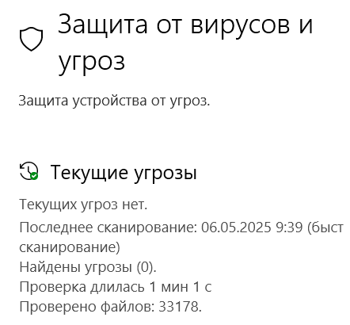
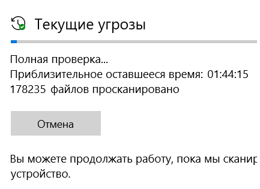
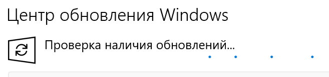
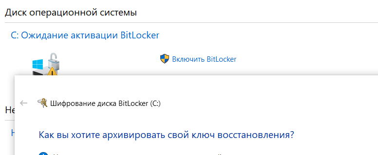
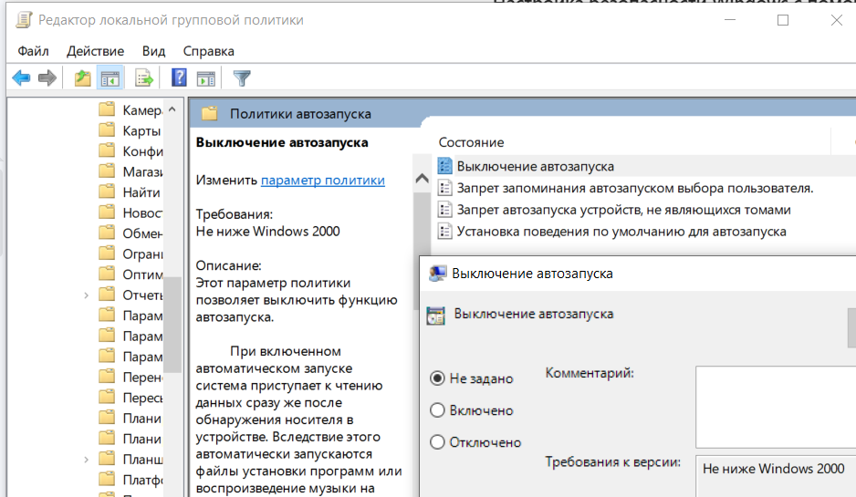
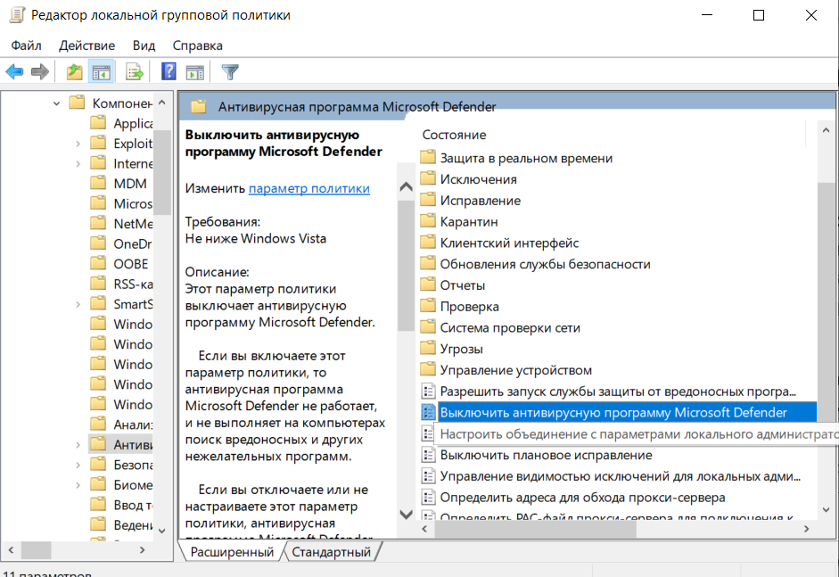

# Учебная практика: Установка антивирусного ПО и настройка безопасности
---
## 1. Обоснование выбора антивирусного ПО

Исследуйте **три популярных антивируса** (например: Kaspersky, Avast, Bitdefender, Windows Defender и т.д.) и заполните таблицу:

## Сравнительная таблица

| Антивирус       | Плюсы | Минусы | Бесплатная версия | Потребление ресурсов | Реклама в бесплатной версии |
|-----------------|-------|--------|--------------------|----------------------|-----------------------------|
| **Пример: Avast**   | - Удобный интерфейс  | Есть бесплатная версия | Навязывает установку доп. ПО  | Среднее | Да |
| **Kaspersky**   | - Высокая эффективность против угроз - Хорошая защита в реальном времени - Доп. функции (VPN, родительский контроль) | - Платный вариант дороже конкурентов - Подозрения в связях с российским правительством | Да (Kaspersky Free) | Среднее | Минимальная |
| **Bitdefender** | - Отличная защита от malware - Низкое влияние на систему - Автоматический режим работы | - Бесплатная версия ограничена - Интерфейс сложнее для новичков | Да (Bitdefender Free) | Низкое | Нет |
| **Windows Defender** | - Встроен в Windows, бесплатный - Хорошая базовая защита - Минимальное влияние на производительность | - Менее эффективен против сложных угроз - Ограниченные дополнительные функции | Да (встроен) | Низкое | Нет |

## Выбранный антивирус
**Windows Defender**

### Причины выбора:
+ Уже установлен – не нужно ничего скачивать
+ Бесплатный – без подписок и скрытых платежей
+ Минимальное влияние на систему – почти не грузит ПК
+ Интеграция с Windows – работает без конфликтов
+ Базовой защиты достаточно для большинства пользователей

---

## 2. Установка антивируса

+ Антивирус уже скачан
- Установить дополнительные компоненты не требовалось?

**Скриншоты:**  

---

## 3. Первичная настройка безопасности

- ✅ Настройка автоматического сканирования (указать когда запускается)
- ✅ Включена активная защита (по умолчанию активна в реальном времени).
- ✅ Проведена полная проверка системы (запущена вручную).

**Скриншоты настроек:**  

---

## 4. Дополнительные меры безопасности

- [ ] Обновление системы Windows / драйверов

- [ ] Включение BitLocker или другого шифрования

- [ ] Отключение автозапуска с флешек

---

## 5. Настройка двухфакторной аутентификации для аккаунтов.

Была включена двухфакторная аутентификация на Google:

- **Google:**
  - Зайти в аккаунт Google → "Безопасность" → "Двухэтапная аутентификация".
  - Установлено приложение Google Authenticator, отсканирован QR-код, сохранены резервные коды.
## Подводятся итоги: что нового узнали, что было непонятно, какие выводы сделали

**Вывод:** Исследовали популярные антивирусы, научились первичной настройке безопасности и настройке двухфакторной аутентификации

## Отключение антивируса
+ Запустить `gpedit.msc`.
