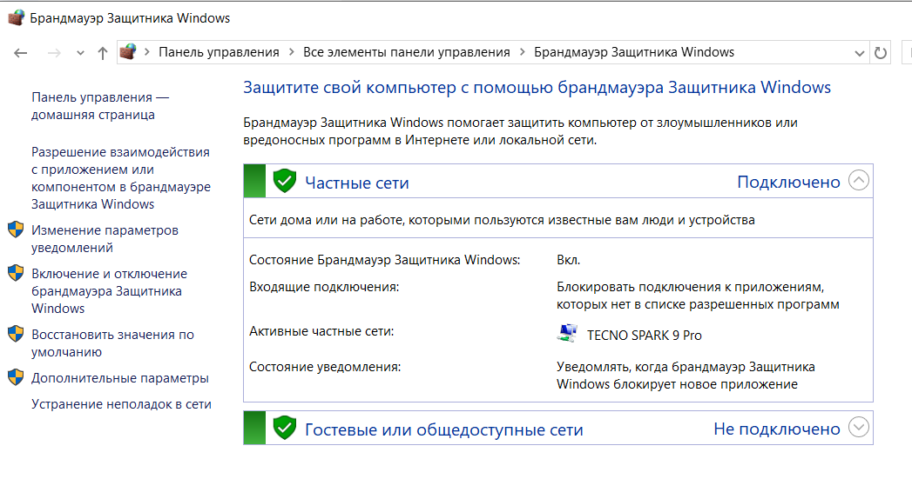
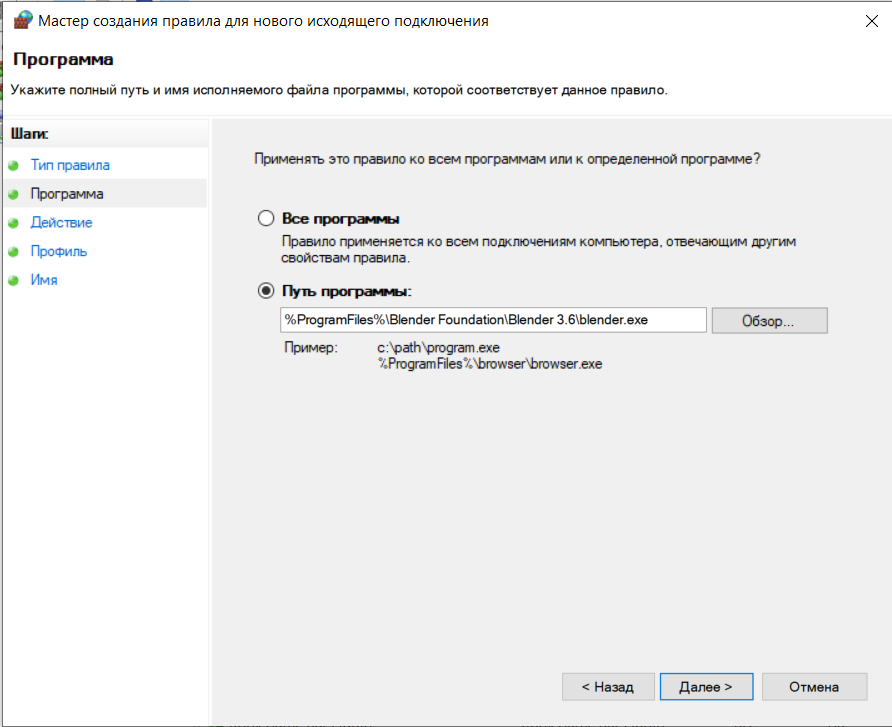
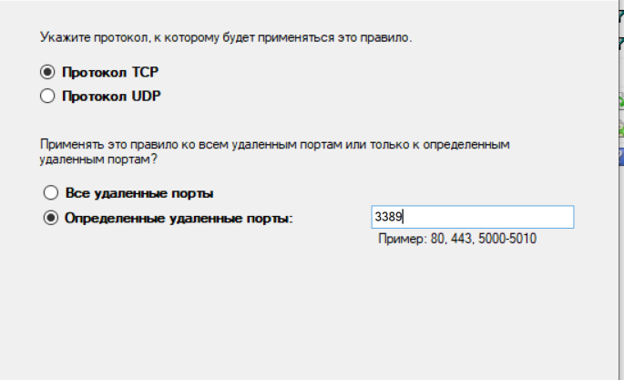
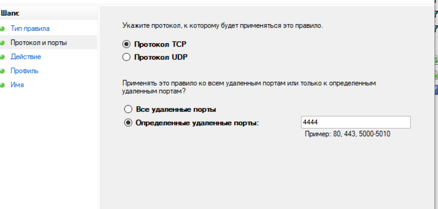
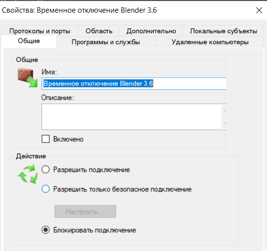
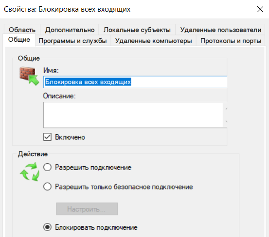
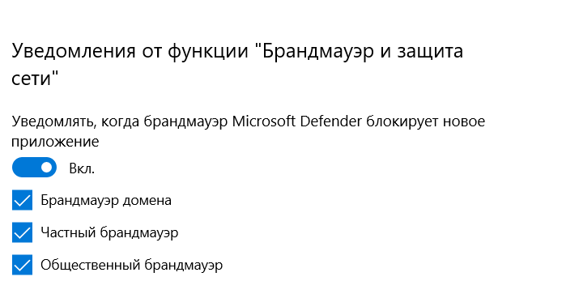
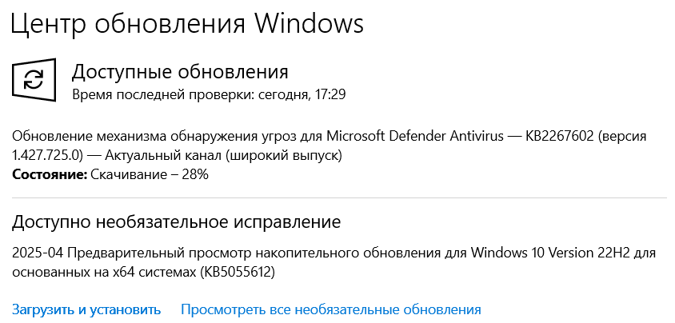

# 🔐 Учебная практика: Конфигурация брандмауэров и систем защиты данных

---

## 1. Изучение понятий

Перед началом практики кратко опишите:

- Что такое **брандмауэр (Firewall)**?  
**Брандмауэр** — это программный или аппаратный барьер между устройством/сетью и внешним миром (например, интернетом). Он контролирует входящий и исходящий трафик на основе заданных правил, блокируя потенциально опасные соединения.
- Какие бывают типы брандмауэров (сетевой, персональный, аппаратный и т.д.)?

| Тип | Описание | Примеры |
|-----|----------|---------|
| **Сетевой** | Защищает всю сеть, работает на уровне маршрутизаторов | Cisco ASA, pfSense |
| **Персональный** | Устанавливается на отдельные устройства | Windows Defender Firewall |
| **Аппаратный** | Физическое устройство для защиты сети | FortiGate, Juniper SRX |

- Что включают в себя **системы защиты данных**?
1. **Шифрование данных**
2. **Защита от вредоносного ПО**
3. **Контроль доступа**
4. **Мониторинг и анализ**
5. **Резервное копирование**
---

## 2. Сравнение популярных решений

Выберите **3 популярные системы защиты с брандмауэрами** (например: Windows Defender Firewall, Comodo Firewall, ZoneAlarm, TinyWall и т.д.).

| Продукт             | Тип брандмауэра | Уровень контроля | Простой/сложный | Особенности |
|---------------------|------------------|------------------|------------------|-------------|
| Пример: TinyWall    | Персональный     | Средний          | Простой          | Не требует инсталляции |
| **Windows Defender Firewall** | Персональный     | Высокий          | Простой                | Встроен в Windows, интеграция с другими компонентами защиты                |
| **Comodo Firewall**   | Персональный     | Очень высокий    | Средний                | Продвинутые функции HIPS, песочница для программ, бесплатная версия        |
| **TinyWall**          | Персональный     | Средний          | Очень простой          | Минималистичный, не требует установки, подходит для начинающих             |

**Выбранный продукт:**  
`Windows Defender Firewall`

**Причина выбора:**  
1. **Интеграция с системой** - уже встроен в Windows, не требует дополнительной установки  
2. **Баланс безопасности и удобства** - обеспечивает хорошую защиту без сложных настроек  
3. **Низкое потребление ресурсов** - не замедляет работу системы  
4. **Регулярные обновления** - автоматически обновляется через Windows Update  
5. **Совместимость** - оптимально работает с другими компонентами Windows Security  

---

## 3. Установка и базовая настройка

### Процесс установки
Поскольку Windows Defender Firewall является встроенным компонентом Windows, отдельная установка не требуется. Однако нужно проверить его активность:

**Проверка состояния**:
   - Откройте `Панель управления` → `Система и безопасность` → `Брандмауэр Защитника Windows`
   - Убедитесь, что статус показывает "Включено" для обоих профилей (частная и общественная сети)

---

## 4. Конфигурация правил доступа

Настройте минимум 5 правил:

- Разрешить/запретить выход в интернет для конкретной программы
**Действие**: Блокировать исходящие соединения для Blender 3.6    
**Как настроить**:
1. Открыть "Дополнительные параметры" брандмауэра
2. Создать новое исходящее правило
3. Выбрать путь к exe-файлу
4. Установить действие "Блокировать подключение"

- Настройка входящих и исходящих соединений
**Действие**: Разрешить входящие подключения по RDP (порт 3389)  
**Цель**: Возможность удаленного администрирования  
**Как настроить**:
1. Создать новое входящее правило
2. Выбрать тип "Для порта"
3. Указать TCP 3389
4. Разрешить подключение только с доверенных IP

- Создание пользовательского правила (например, для специфичного порта)
**Действие**: Заблокировать входящие/исходящие соединения на порт 4444  
**Цель**: Защита от потенциальных бэкдоров  
**Как настроить**:
1. Создать два правила (входящее и исходящее)
2. Указать порт 4444 для TCP/UDP
3. Установить действие "Блокировать"

- Временная блокировка доступа для приложения
**Действие**: Создать правило с отключенным состоянием для 
**Цель**: Возможность быстрой временной блокировки  
**Как настроил**:
1. Создать исходящее правило для Blender 3.6
2. Установить"Блокировать"
3. Отключить правило (галочка "Включено" снята)
4. При необходимости можно быстро включить

---

## 5. Защита данных

Настройте дополнительные элементы защиты:

- [ ] Блокировка неизвестных подключений

- [ ] Включение уведомлений о попытках несанкционированного доступа

---

## 6. Дополнительные меры

- [ ] Убедитесь, что ОС обновлена

---
