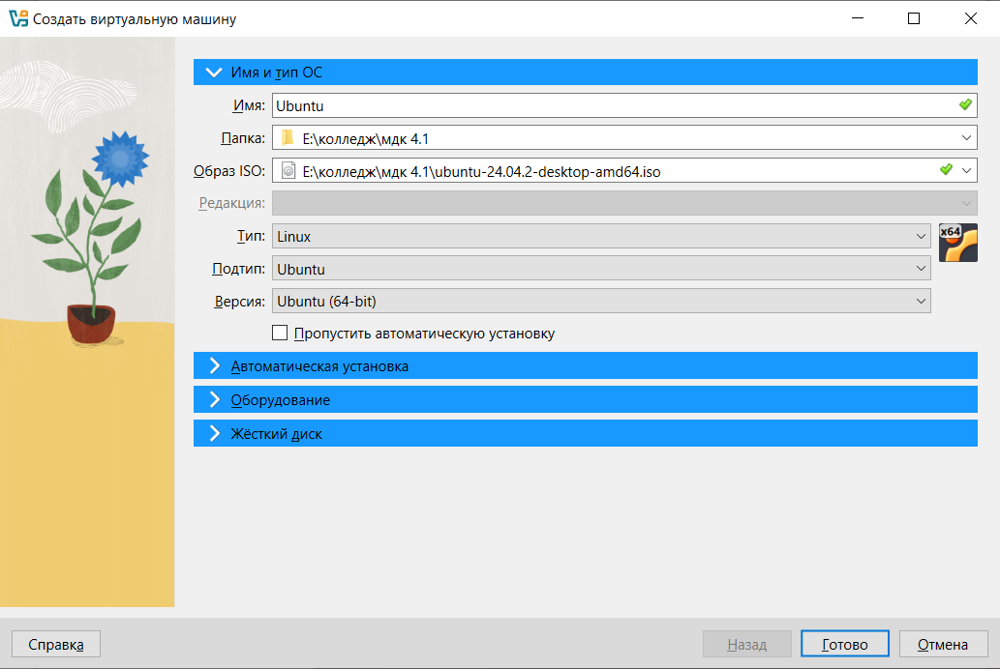
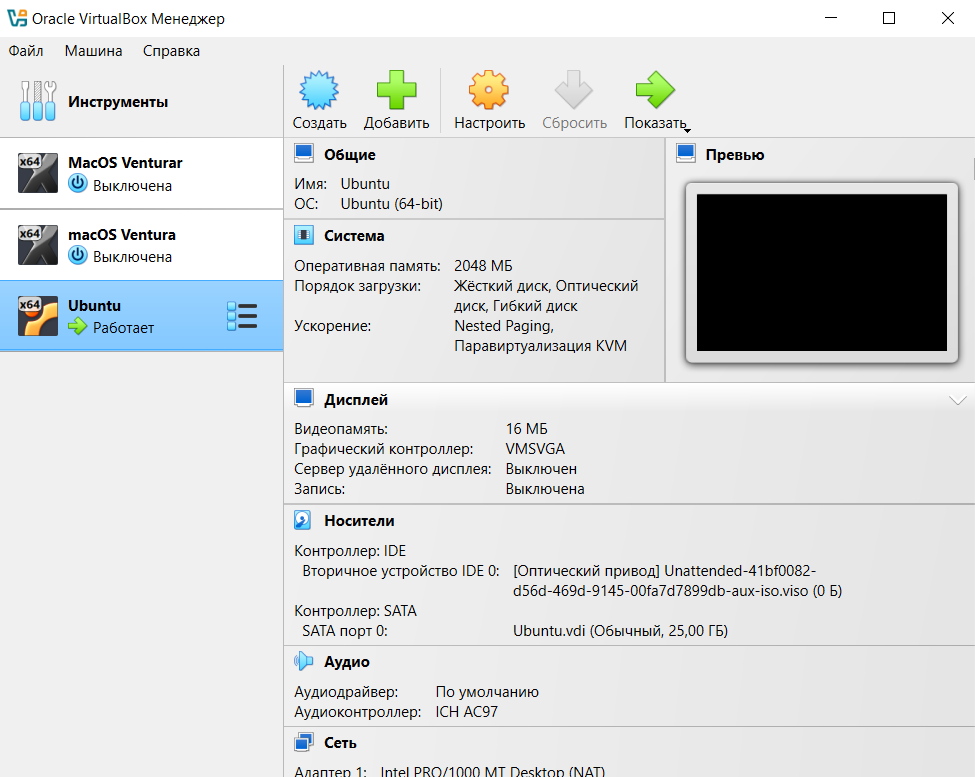
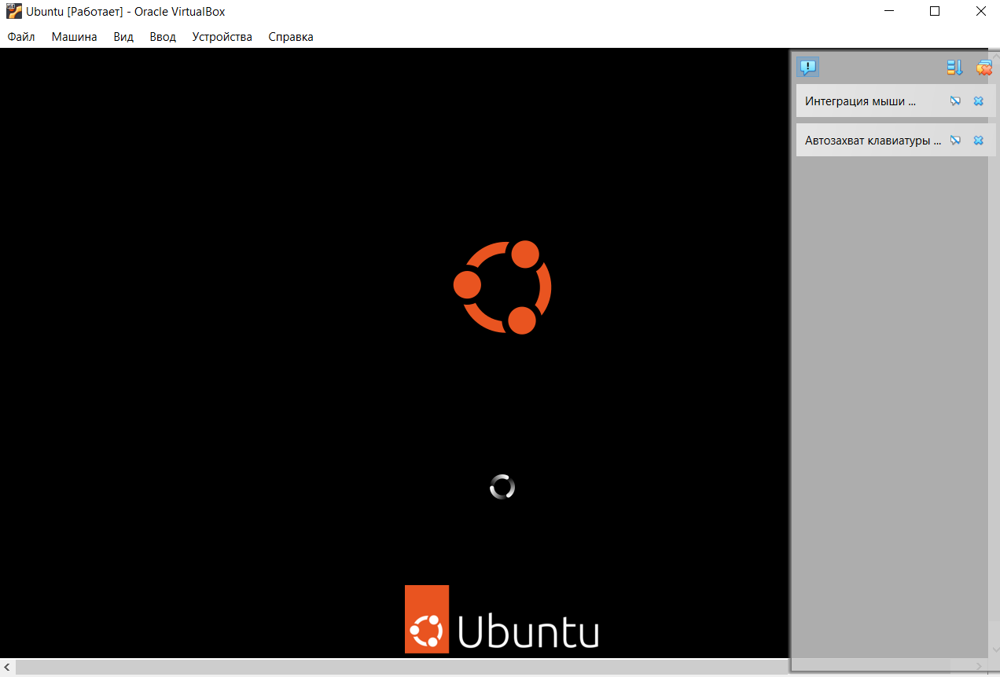
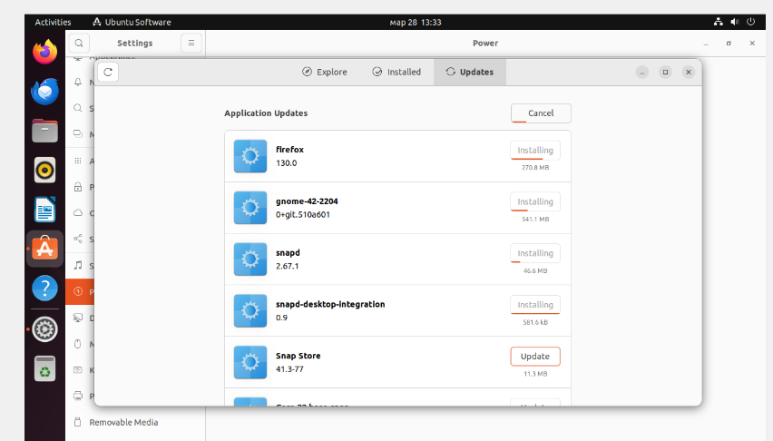

# Отчет по учебной практике
**Цель**: Ознакомиться с процессом загрузки и установки программного обеспечения на различных операционных системах, таких как macOS и Linux.
### Задание: Установка программного обеспечения на Linux
**Выбор дистрибутива:**

* Был выбран дистрибутив Ubuntu для установки.
* Образ ISO был загружен с официального сайта Ubuntu.

* Полсле установки запускаем Ubuntu на VirtualBox

* Виртуальная машина была запущена, и началась установка Ubuntu с виртуального CD/DVD диска.

* Следуя инструкциям на экране, была успешно завершена установка операционной системы на виртуальную машину.

* Был использован APT (Advanced Package Tool) для установки необходимого программного обеспечения.

### Заключение
Практика по установке Ubuntu на виртуальную машину была успешно выполнена. Были получены навыки работы с операционной системой Linux в виртуальной среде, установки и настройки программного обеспечения, а также решения возникающих проблем.