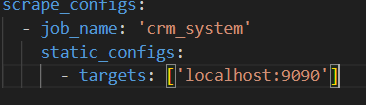

# Практическая работа  
**Тема:** Применение методов обеспечения качества функционирования компьютерных систем  
**Цель:** Ознакомиться с практическими аспектами стандартизации, тестирования и защиты информации.  
## Задание 1. Анализ требований к качеству ПО  
1. **Составление матрицы качества по ISO 9126:**
   a) Создайте таблицу с основными характеристиками:
      - Функциональность
      - Надежность
      - Удобство использования
      - Эффективность
      - Сопровождаемость
      - Переносимость
   
   b) Для каждой характеристики определите метрики:
      ```
      Пример для надежности:
      - Время безотказной работы: >99.9%
      - Среднее время восстановления: <15 минут
      - Максимальное количество ошибок: <0.1% запросов
      ```

## Матрица качества CRM-системы по ISO 9126

#### 1. Функциональность
| Метрика                           | Целевое значение       |
|-----------------------------------|------------------------|
| Полнота реализации требований     | 100%                   |
| Корректность обработки данных     | < 0.1% ошибок          |

#### 2. Надежность
| Метрика                           | Целевое значение       |
|-----------------------------------|------------------------|
| Время безотказной работы          | > 99.9% uptime         |
| Среднее время восстановления (MTTR)| < 15 минут            |
| Частота ошибок                    | < 0.1% запросов        |

#### 3. Удобство использования
| Метрика                           | Целевое значение       |
|-----------------------------------|------------------------|
| Время обучения пользователя       | < 1 часа               |
| Удовлетворенность (NPS)           | > 4 из 5 баллов        |

#### 4. Эффективность
| Метрика                           | Целевое значение       |
|-----------------------------------|------------------------|
| Время отклика системы             | < 500 мс               |
| Пропускная способность            | 10 000 запросов/час    |

#### 5. Сопровождаемость
| Метрика                           | Целевое значение       |
|-----------------------------------|------------------------|
| Время внесения изменений          | < 2 часов              |
| Покрытие кода тестами             | > 80%                  |

#### 6. Переносимость
| Метрика                           | Целевое значение |
|-----------------------------------|------------------------|
| Совместимость с ОС                | Windows 10/11, Linux   |
| Время развертывания на новой ОС   | < 30 минут             |

2. **Настройка мониторинга производительности:**
   a) Установите Prometheus:
      - Настройте сбор метрик
      
      - Определите ключевые показатели (KPI)
      KPI для мониторинга:
    `http_requests_total` (количество запросов).
`http_response_time_ms` (время отклика).
`system_cpu_usage` (нагрузка CPU).

   b) Настройте Grafana:
      - Создайте дашборды для:
        * Время отклика: `avg(rate(http_response_time_ms[1m]))`.
        * Запросы в секунду: `rate(http_requests_total[1m])`.
        * Ошибки: `sum(rate(http_requests_failed[1m])) by (status)`.
## Задание 2. Разработка плана тестирования

### 1. Введение
**Цель тестирования:** Обеспечение надежности, безопасности и производительности веб-приложения для онлайн-обучения с акцентом на:
- Защиту персональных данных пользователей
- Стабильность работы при высокой нагрузке
- Корректность функциональности ключевых сценариев

**Тестируемая система:** Веб-приложение онлайн-школы с функциями:
- Авторизация пользователей
- Просмотр и прохождение курсов
- Система оплаты
- Личный кабинет
- Административная панель

### 2. Виды тестирования

#### 2.1. Функциональное тестирование
**Область покрытия:**
- Работа форм авторизации/регистрации
- Функционал курсов (просмотр, прогресс, тесты)
- Платежная система
- Личный кабинет пользователя

**Пример теста:**

```python
def test_course_progress():
    driver = webdriver.Chrome()
    login(driver, "test@mail.com", "password123")
    driver.get("/course/python-basics")
    complete_lesson(driver, lesson_id=1)
    assert get_progress(driver) == "25%", "Прогресс курса не обновился"
```


#### 2.2. Тестирование безопасности
Ключевые проверки:


| Уязвимость | Метод проверки| Ожидаемый результат |
|-------------|-------------|-------------|
| SQL-инъекции   | Ввод ' OR '1'='1 в логин/пароль    | Ошибка авторизации    |
XSS |	Ввод `<script>alert(1)</script>` |	Скрипт не выполняется |
| CSRF |	Отправка формы без токена |	Отказ в обработке запроса |

**Инструменты**:
* OWASP ZAP
* Burp Suite
* Nmap

#### 2.3. Нагрузочное тестирование
**Сценарии:**

* 500+ одновременных пользователей:
* 70% просматривают курсы
* 20% проходят тесты
* 10% совершают платежи

**Команда для запуска:**
`locust -f load_test.py --users 500 --spawn-rate 50`

#### 2.4. Юзабилити-тестирование
**Чек-лист:**

* Интуитивная навигация
* Адаптивность под мобильные устройства
* Соответствие WCAG 2.1

#### 3. Этапы тестирования
1. Подготовка (1 день)

+ Настройка тестового окружения

+ Создание тестовых данных

2. Функциональное тестирование (2 дня)

+ Автоматизированные UI-тесты

+ Проверка API

3. Тестирование безопасности (2 дня)

+ Сканирование OWASP ZAP
+ Ручной аудит
4. Нагрузочное тестирование (1 день)

5. Финальный отчет (1 день)

### Задание 3. Конфигурационное управление

### 1. Настройка CI/CD пайплайна в GitHub Actions

#### 1.1. Базовый workflow для тестирования

```yaml
name: CI/CD Pipeline
on:
  push:
    branches: [ main ]
  pull_request:
    branches: [ main ]

jobs:
  test:
    runs-on: ubuntu-latest
    steps:
      - uses: actions/checkout@v2
      
      - name: Setup Node.js
        uses: actions/setup-node@v2
        with:
          node-version: '16'
          
      - name: Install dependencies
        run: npm install
          
      - name: Run unit tests
        run: npm test
          
      - name: Security audit
        run: npm audit
          
      - name: Container scanning
        uses: aquasecurity/trivy-action@master
        with:
          image-ref: '.'
          format: 'table'
          exit-code: '1'

          
```
2. Стратегия управления окружениями

| Окружение | Назначение| Автодеплой |	Доступ |
|-------------|-------------|-------|------|	
| dev	| Разработка новых фич |	При push |	Только команда |
|staging|	Тестирование перед продом|	Вручную|	QA, PM|
|prod|	Продакшен|	Теги v1.0+|	Все пользователи|


####  Система откатов (Rollback)
1. Автоматический откат при:

+ Неудачных тестах

+ Ошибках health-check в течение 5 минут

2. Ручной откат через:

`gh workflow run rollback.yml -f version=1.2.1`

