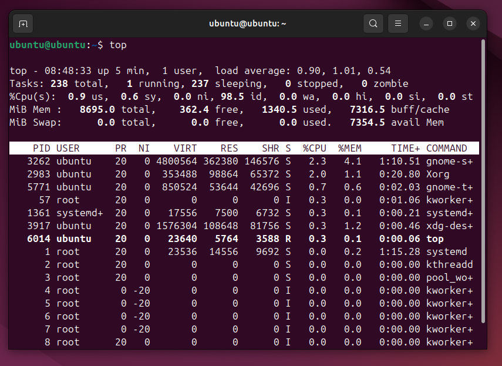
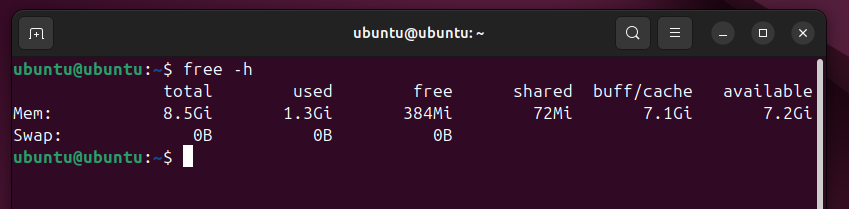
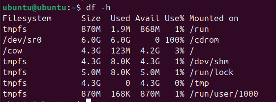
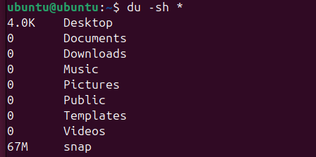

# 🖥️ Учебная практика: Настройка мониторинга работоспособности ПО (системные утилиты)


## 1. Теоретическая часть

### Что надо знать:

- Мониторинг — это наблюдение за работой системы или программы.
- Что можно мониторить:
  - Процессор (CPU)
  - Память (RAM)
  - Место на диске
  - Активные процессы
  - Системные логи

---

## 2. Простые задачи (выбери любые 3 и сделай отчёт)

### ✅ Задача 1: Посмотри, как грузится система
Использовала ОС Ubuntu
**Команды:**
- `top` или `htop`

- `free -h`


---

### ✅ Задача 3: Проверка диска

**Команды:**
- `df -h`

- `du -sh *`



---

### ✅ Задача 4: Лог-файлы

**Команды:**
- `dmesg | tail`
- `journalctl -xe`


---

### ✅ Задача 5: Скрипт-монитор

**Пример скрипта:**

```bash
#!/bin/bash
echo "Мониторинг:"
date
uptime
free -h
```

1. `echo "Мониторинг:"`
- Выводит заголовок "Мониторинг"
2. date
- Показывает текущие дату и время
3. uptime
- Показывает:
- - Текущее время работы системы
- - Количество активных пользователей
- - Среднюю нагрузку на CPU за 1, 5 и 15 минут
4. free -h
- Показывает использование памяти в удобном формате:
- - Общая память (total)
- - Используемая (used)
- - Свободная (free)
- - Память в кэше (buff/cache)
- - Доступная (available)
---

## 3. Выводы

- Какие команды были полезны?
- Что нового узнал?
- Как бы ты автоматизировал мониторинг?


# Выводы по задаче мониторинга системы

## 1. Полезные команды

- `htop`/`top` - мониторинг загрузки CPU и процессов
- `free -h` - информация об использовании памяти (RAM + Swap) 
- `uptime` - время работы системы и нагрузка
- `date` - временные метки для логов

## 2. Новые знания

### Анализ памяти (`free -h`)
- `available` важнее `free` (учитывает кэш)
- Активное использование swap указывает на нехватку RAM

### Интерпретация `uptime`
- Load average 1.00 на 4-ядерном CPU = 25% загрузка
- Значения выше числа ядер - система перегружена

### Разница `htop` vs `top`
| Особенность | htop | top |
|-------------|------|-----|
| Цвета       | ✅   | ❌  |
| Управление мышкой | ✅ | ❌ |
| Сортировка  | ✅   | ❌  |
| Предустановлен | ❌ | ✅ |

