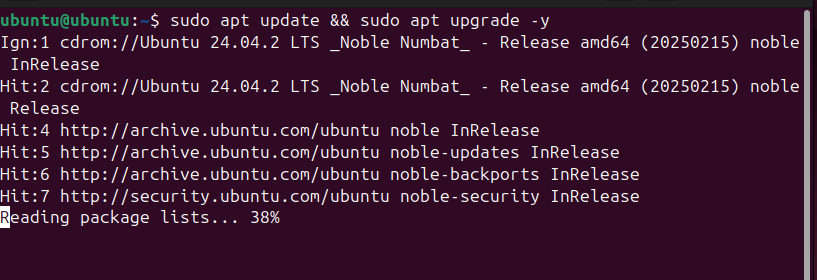
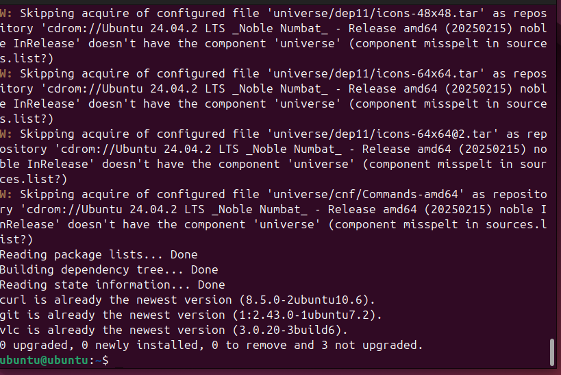
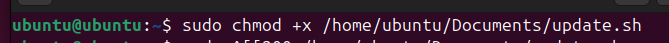
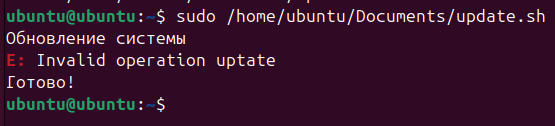
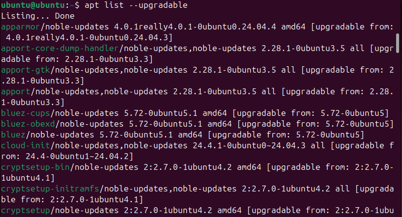
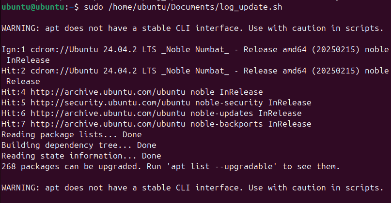

# 🔄 Учебная практика: Автоматизация обновления и патчинга ПО

---

## 1. Теоретическая часть — что, зачем и почему

### 📘 Зачем обновлять ПО?

- Закрытие известных уязвимостей (патчи безопасности)
- Повышение стабильности (фиксы багов)
- Добавление новых возможностей (фичи)
- Улучшение совместимости с ОС и другим софтом

### ⚠️ Что будет, если не обновлять?

- Взлом через известную дыру (например, EternalBlue — WannaCry)
- Отвалившиеся зависимости, несовместимость
- Нестабильная работа, фризы, падения
- Утечка данных, штрафы (особенно если ты в GDPR-зоне)

---

## 🤖 Ручное vs Автоматическое обновление

| Характеристика         | Ручное обновление       | Автоматическое обновление       |
|------------------------|-------------------------|---------------------------------|
| Контроль               | Полный                  | Частичный                       |
| Риск забыть            | Высокий                 | Низкий                          |
| Возможность протестить | Да                      | Не всегда (если auto)           |
| Требует времени        | Да                      | Нет                             |
| Подходит для сервера   | Нет                     | Да, с тестированием             |

---

## 🛠 Способы автоматизации:

- **Менеджеры пакетов:** `apt`, `yum`, `dnf`, `snap`, `flatpak`
- **Планировщики задач:** `cron`, `systemd.timer`
- **Скрипты и CI/CD:** `bash`, `python`, `GitHub Actions`, `GitLab CI`
- **Конфигурационные тулзы:** `Ansible`, `Puppet`, `Chef`, `SaltStack`

---

## 📉 Истории провалов (реальные кейсы)

- **Equifax 2017:** не обновили Apache Struts → миллионы утекших данных
- **WannaCry 2017:** патч от Microsoft был за 2 месяца до атаки
- **Heartbleed 2014:** OpenSSL баг, который знали, но не обновили

---


---

### ✅ Задача 1: Ручное обновление системы

**Что сделать:**
- Выполни `sudo apt update && sudo apt upgrade -y`
- Сделай скриншот или лог


---

### ✅ Задача 3: Обновление конкретного ПО

**Что сделать:**
- Установи/обнови `curl`, `vlc`, `git`:
```bash
sudo apt install --only-upgrade curl git vlc
```
1. Выполнение команды `sudo apt update && sudo apt install -y curl git vlc` для установки.
2. 

**Что написать:**
- Почему выборочное обновление бывает удобнее?
- Что может пойти не так?
# Выборочное обновление пакетов (`--only-upgrade`)

**Плюсы:**  
✅ Точечное обновление без затрагивания зависимостей  
✅ Безопасно для production-сред  
✅ Экономит трафик  

**Минусы:**  
⚠️ Может пропустить важные обновления зависимостей  
⚠️ Не устанавливает отсутствующие пакеты  
⚠️ Риск несовместимости версий  

**Команды:**  
```bash
# Установка/обновление (универсально)
sudo apt update && sudo apt install curl git vlc

# Только обновление существующих
sudo apt install --only-upgrade curl git vlc
```
---

### ✅ Задача 4: Напиши скрипт обновления

**Скрипт:**
```bash
#!/bin/bash
echo "Обновление системы:"
apt update && apt upgrade -y
echo "Готово!"
```

**Что сделать:**
- Сохрани как `update.sh`, дай права на запуск (`chmod +x`)
- Запусти

**Что приложить:**
- Скрин результата
- Комментарии по работе скрипта

---

### ✅ Задача 5: Проверка уязвимостей

**Что сделать:**
- Запусти:
```bash
apt list --upgradable
```
- Можно установить `lynis` и запустить аудит


---


---

### ✅ Задача 8: Ведение логов обновлений

**Что сделать:**
- Создай скрипт `log_update.sh`:

```bash
#!/bin/bash
echo "⏱️ Обновление от $(date)" >> ~/update_log.txt
apt list --upgradable >> ~/update_log.txt
apt update && apt upgrade -y >> ~/update_log.txt
echo "===============================" >> ~/update_log.txt
```

- Запусти, посмотри файл `~/update_log.txt`

**Что написать:**
- Что в логе?
- Зачем это нужно?
1. **История обновлений** - видно, когда и какие пакеты обновлялись

2. **Отслеживание изменений** - помогает найти проблемные обновления, если после обновления что-то сломалось

3. **Аудит безопасности** - можно проверить, актуальны ли критические пакеты

4. **Автоматизация** - скрипт можно добавить в cron для регулярного запуска
---

### ✅ Задача 9: Напоминалка об обновлениях

**Что сделать:**
- Напиши скрипт `notify_updates.sh`:

```bash
#!/bin/bash
echo "Доступные обновления:"
apt list --upgradable | grep -v "Listing"
```

- Можно добавить в `cron`:
```bash
0 9 * * * bash /путь/к/notify_updates.sh >> ~/update_reminder.txt
```

**Что написать:**
- Как часто надо проверять?
На персональных компьютерах рекомендуется проверять ежедневно
- Почему важно не забывать?
1. Безопасность
2. Стабильность работы
3. Новые функции
4. Совместимость
5. Юридические требования

---

## 3. Выводы

- Какие задачи были самыми полезными?
- Что нового узнал?
- Будешь ли использовать автообновления в своих проектах?


## 🔥 Самые полезные задачи:
1. **Скрипт логирования обновлений** (`log_update.sh`)  
   - Понятная история изменений  
   - Возможность отката при проблемах  

2. **Уведомления о доступных обновлениях** (`notify_updates.sh`)  
   - Не пропускаем критические security-фиксы  
   - GUI-оповещения для десктопов  

3. **Безопасное обновление через `--only-upgrade`**  
   - Точечные изменения без риска сломать зависимости  

## 🧠 Что нового узнал:
- **Systemd-сервисы** могут иметь альтернативные имена (`nginx` vs `nginx.service`)  
- **Автоочистка** через `apt autoremove` предотвращает "захламление" системы  
- **Логи в /var/log/** — лучшая практика для серверных скриптов  

## 🤖 Буду ли использовать автообновления?
| Тип проекта       | Стратегия обновлений               | Почему?                     |
|-------------------|------------------------------------|-----------------------------|
| Личный ПК         | Уведомления + ручное подтверждение | Контроль над окружением     |
| Продакшен-сервер  | Только security-фиксы автоматически | Минимизация downtime        |
| Демо-стенды       | Полное автообновление              | Всегда актуальные версии    |

> **Итог:** Комбинация автоматических проверок + ручного подтверждения для критических систем — оптимальный баланс безопасности и стабильности.