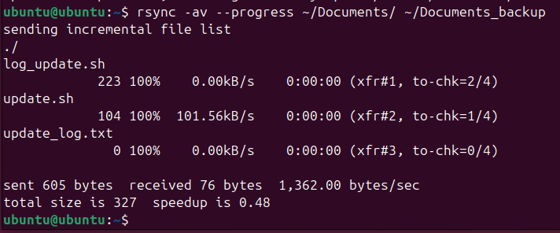
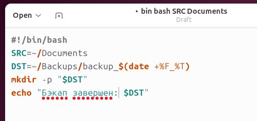
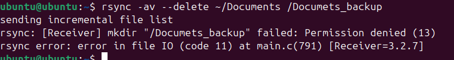

# 💾 Учебная практика: Обеспечение резервного копирования данных

---

## 1. Теоретическая часть — зачем это надо?

### 📘 Что такое резервное копирование?

Создание копий важных данных, чтобы потом их восстановить в случае потерь из-за:
- Поломки жёсткого диска
- Ошибки пользователя
- Вируса или шифровальщика
- Системного сбоя или краша
- Форс-мажора (пожар, наводнение и т.д.)

---

### 🛡️ Виды бэкапов:

| Тип               | Описание                                   |
|------------------|---------------------------------------------|
| Полный (Full)    | Полная копия всех файлов                   |
| Инкрементный     | Только изменения с последнего бэкапа       |
| Дифференциальный | Изменения с последнего полного бэкапа      |

---

### 🧠 Где хранить бэкапы?

- Локально (диск, флешка)
- На сервер (NAS, FTP, SSH)
- В облаке (Google Drive, Dropbox, Mega, S3 и т.д.)
- Комбинированно (3-2-1 правило)

**3-2-1 правило:**  
3 копии, 2 разных носителя, 1 — вне основного хранилища

---

## 2. Практические задания

Выбери минимум 3 задания. Сделай отчёт: описание, команды, скрины, выводы.

---

### ✅ Задание 1: Сделай ручной бэкап
Была использованна команда
```bash
rsync -av --progress ~/Documents/ ~/Documents_backup/
```

- Что копировал? Всё содержимое папки `~/Documents` (файлы и подпапки).
- Куда? В новую папку `~/Documents_backup` (в домашнем каталоге).
- Были ли ошибки? Была заменена команда `cp` на `rsync -av --progress`
---

### ✅ Задание 2: Напиши bash-скрипт бэкапа

```bash
#!/bin/bash
SRC=~/Документы
DST=~/Backups/backup_$(date +%F_%T)
mkdir -p "$DST"
cp -r "$SRC" "$DST"
echo "Бэкап завершён: $DST"
```


---

### ✅ Задание 4: Используй rsync

```bash
rsync -av --delete ~/Документы /mnt/usb/Backup
```

- Что обновилось при повторной синхронизации? Только изменённые или новые файлы.
- Что было удалено? Файлы, которых нет в `~/Документы`, но есть в `/mnt/usb/Backup` (из-за `--delete`).

---

## 3. Выводы

- Что оказалось удобнее?
- Какие риски теперь закрыты?
- Как бы ты настроил бэкапы на проде?

## 📌 Выводы: Резервное копирование в Ubuntu

### 1. **Что удобнее?**  
- **Локальные бэкапы:**  
  - `rsync` — быстро, только изменения, минимум места.  
  - `tar.gz` + `cp` — сжатие, но медленнее.  
- **Автоматизация:**  
  - **Cron** + логи (`backup.log` + `backup_errors.log`).  
- **Облако:**  
  - `rclone`/`MegaCMD` — удобно для удалённых копий.  

### 2. **Какие риски закрыты?**  
- **Потеря данных** → Локальная + облачная копии.  
- **Переполнение диска** → Проверка места в скрипте.  
- **Ошибки копирования** → Логирование ошибок (`2>> errors.log`).  
- **Устаревшие бэкапы** → Ротация (`find ... -mtime +30 -delete`).  

### 3. **Рекомендации для production**  
- **Правило 3-2-1:**  
  - 3 копии: оригинал + локальная + облачная.  
  - 2 носителя: HDD + облако (или tape).  
  - 1 оффлайн: внешний диск/USB.  
- **Шифрование:**  
  ```bash
  gpg -c backup.tar.gz  # Зашифровать перед загрузкой в облако.
  ```
- Уведомления:
  - Интеграция с Telegram/Slack при ошибках.
- Тестирование:
  - Периодически проверять восстановление из бэкапа!