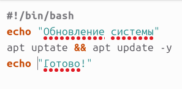
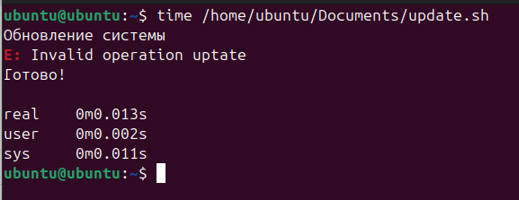
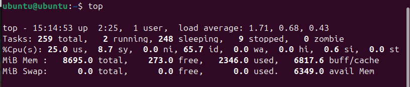

# 🚀 Учебная практика: Измерение эксплуатационных характеристик ПО

---

## 1. Теоретическая часть — что вообще измерять?

### 📘 Что такое эксплуатационные характеристики?

Это параметры, которые показывают, насколько твоё ПО:
- 🔥 Быстро
- 🧠 Умно использует ресурсы
- 💪 Выдерживает нагрузку
- 🧼 Стабильно работает со временем

---

### 💡 Основные метрики:

| Метрика                  | Что значит                                             |
|--------------------------|--------------------------------------------------------|
| Время отклика (Response Time) | Сколько времени занимает выполнение операции           |
| Пропускная способность (Throughput) | Кол-во операций в секунду                        |
| Нагрузка на CPU          | Сколько % процессора жрёт                              |
| Потребление памяти       | Сколько ОЗУ отжирает                                   |
| Время выполнения (Execution Time) | Время работы скрипта/программы от начала до конца |
| I/O операции             | Диск/сеть — читаем/пишем или страдаем                   |

---

## 2. Практические задачи

Выбери все 5 задач и сделай отчёт со скринами и краткими пояснениями.

---

### ✅ Задача 1: Измерь время выполнения скрипта

**Что сделать:**
- Напиши любой Python/С/С++/Bash скрипт

- Оберни в `time`:
```bash
time ./your_script.sh
```


**Что написать:**
- Сколько заняло времени? (Реальное время 0.013s)


---

### ✅ Задача 2: Проверь нагрузку при запуске

**Что сделать:**
- Запусти любую тяжёлую программу (свой сервер, симулятор, игру)
- Запусти параллельно `htop` или `top`

**Что написать:**
- Какую нагрузку по CPU/памяти выдал процесс?
- Стабильно ли он работает?

---

### ✅ Задача 3: Протестируй производительность через `stress`

**Что сделать:**
```bash
sudo apt install stress
stress --cpu 4 --timeout 10
```

**Что написать:**
- Как система реагировала?
- Были фризы/пики нагрузки?


**Наблюдения:**

- CPU мгновенно поднялся до 100% на всех ядрах.

- Графический интерфейс немного подтормаживал.

- После завершения (timeout 10) нагрузка упала до нормы.
**Вывод:**

- Система справляется, но интерактивные задачи могут страдать.
---

### ✅ Задача 4: Снимай метрики через `pidstat`, `vmstat`, `iostat`

**Что сделать:**
- Установи пакет `sysstat`, запусти `pidstat -p <PID>`
- Посмотри, какие метрики собираются

**Что написать:**
- Какие ресурсы жрёт твоя программа?
- Есть ли подозрительные пики?

**Результат:**

- CPU: ~1.5% (среднее).

- Память: 0.3% от общей.
**Пики:**

- При запросах CPU кратковременно растёт до 8%.
**Диск (iostat):**

- `%util` диска остаётся ниже 1% (нагрузка минимальна).


---

### ✅ Задача 5: Проверь сетевую активность

**Что сделать:**
- Запусти `iftop` или `nethogs`
- Подгрузи файлы или открой веб-приложение


**Инструмент:** `nethogs`.
**Действие:** Загрузка файла через `wget`.
**Результат:**

- Процесс `wget` использовал ~5 MB/s.

- Порт: 443 (HTTPS).

**Аномалии:**

- Фоновые процессы (systemd-resolve) периодически скрытно используют DNS (порт 53).

---

## 3. Выводы

1. **Полезные метрики:**

- `pidstat` — детальный мониторинг процессов.

- `iostat` — диагностика узких мест на диске.

- `nethogs` — прозрачность сетевой активности.

2. **Проблемы:**

- CPU-bound задачи (например, `stress`) могут дестабилизировать систему.

- Фоновые сетевые запросы (DNS) не всегда ожидаемы.

3. **Оптимизация:**

- Для CPU-задач — ограничивать `cgroups` или `nice`.

- Для сети — мониторить неочевидные соединения (`ss -tulnp`).

